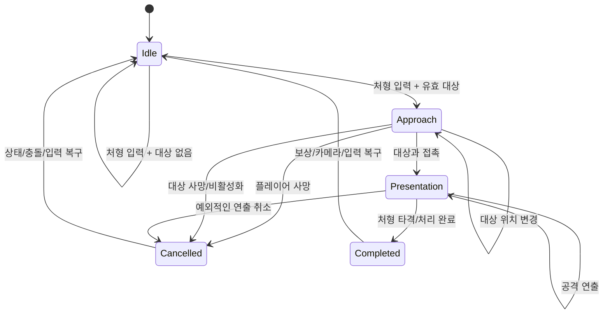

# 처형 기능 개발 계획서

## 1. 문서 목적

이 문서는 현재 Unity 프로젝트에 처형 기능을 추가하기 위한 구현 계획서 겸 구현 인계 문서다.
다른 에이전트가 이어서 작업할 수 있도록 현재 구현 상태, 구현과 기획의 차이, 필요한 코드 경계, 단계별 작업 순서와 검증 기준을 기록한다.

초기 작성 시점에는 계획 단계였으며, 이후 1차 구현이 반영되었다. 아래의 구현 상태와 검증 제한을 계획 원칙과 함께 확인한다.

## 2. 작업 원칙

처형 기능을 개발할 때의 우선순위는 다음과 같다.

1. 현재 저장소의 코드 동작
2. 현재 씬, 프리팹, ScriptableObject, 애니메이션 및 입력 에셋의 실제 연결 상태
3. 현재 구현이 의도하는 기존 게임 규칙
4. 처형 기획문서의 미구현 요구사항

기획문서와 구현이 다르면 먼저 현재 구현을 보존한다. 기획문서의 수치나 규칙을 이유 없이 덮어쓰지 않는다. 변경이 필요하다고 판단되는 경우에도 구현 전에 차이와 변경 이유를 별도로 기록하고 확인한다.

Unity 자산은 연결된 Unity Editor가 있으면 Editor 또는 검증된 Unity 도구로 수정한다. Editor 연결이 없을 때만 텍스트 수정으로 폴백하며, `.unity`, `.prefab`, `.asset`, `.controller`, `.anim` 파일의 GUID와 파일 ID를 보존한다.

## 3. 현재 프로젝트 기준

### 3.1 환경

- Unity `6000.3.20f1` / Unity 6.3 LTS
- 2D URP 프로젝트
- Input System `1.19.0`
- Unity Test Framework `1.6.0`
- 빌드 씬은 현재 `Assets/Scenes/SampleScene.unity` 하나
- 첫 번째 파티 코드에 별도 `.asmdef`는 없음
- WebGL이 최종 배포 대상
- 현재 확인 시 Unity Editor 연결 없음. 실제 Play Mode와 Console 상태는 별도 검증이 필요함

### 3.2 현재 작업 트리 주의사항

계획 작성 시점에 처형 이펙트와 관련된 기존 변경이 작업 트리에 남아 있다. 다른 에이전트는 이 파일들을 처형 구현의 일부라고 단정하거나 되돌리지 말고, 작업 시작 전에 반드시 `git status --short`와 `git diff`를 다시 확인한다.

현재 확인된 기존 변경 예시는 다음과 같다.

- `Assets/Animations/Effects/ExecutionBackgroundEffect.controller` 수정
- `Assets/Prefabs/Player.prefab` 수정
- `Assets/Scenes/SampleScene.unity` 수정
- `Assets/Prefabs/Effects/` 신규 파일
- 일부 기존 Enemy 이펙트 프리팹의 삭제 상태

이 변경들은 처형 구현 작업에서 새로 만든 것으로 간주하지 않는다.

### 3.3 1차 구현 상태 (2026-08-24)

다음 핵심 흐름은 코드와 Player 프리팹에 반영되었다.

- `PlayerExecutionController`가 기존 `Interact` 입력(E)을 사용해 가장 가까운 기절 적을 찾고 접근한다.
- 접근 완료 후 적을 `Executing` 상태로 잠그고, 플레이어 무적·일반 이동·일반 공격을 제어한다.
- 기존 공격 애니메이션을 처형 연출 타이밍에 재사용하고, 처형 타격 시 적 HP를 0으로 만든다.
- 일반 처치와 처형 처치의 보상 원인을 분리하고, 일반 적 회복·보스 최대 HP 회복·영혼 충전을 연결했다.
- 처형 중 배경 이펙트와 카메라 확대를 켜고, 종료 또는 취소 시 원상 복구한다.
- 처형 애니메이션 시작 시 플레이어와 대상의 기존 `SpriteRenderer` Sorting Layer와 Order in Layer를 저장하고, `executionSortingOrder` 값으로 임시 전환한 뒤 모든 종료·취소 경로에서 복구한다. 물리 `GameObject.layer`는 변경하지 않는다.
- 플레이어 사망 또는 오브젝트 비활성화로 처형이 취소되면 대상 적을 다시 기절 상태로 복귀시킨다.
- 보스 판정은 `EnemyData.isBoss`로 추가했으며, 기존 데이터 에셋의 값을 임의로 변경하지 않았다.

자동 EditMode/PlayMode 테스트와 WebGL 빌드는 아직 완료되지 않았다. Unity 에디터 프로세스가 프로젝트를 점유하고 Pipeline 연결이 되지 않아, 별도 배치 테스트가 동일 프로젝트를 열 수 없는 상태다.

## 4. 현재 구현 인벤토리

### 4.1 이미 구현되어 있어 우선 보존할 것

| 영역 | 현재 구현 | 근거 | 처형 작업에서의 처리 |
| --- | --- | --- | --- |
| 적 체력 | `EnemyStatController`가 런타임 HP를 관리하고 피해, 사망, 기절 진입 이벤트를 발생시킴 | `Assets/Scripts/Enemy/EnemyStatController.cs` | 기존 피해 흐름을 유지하고 처형용 종료 경로만 추가 |
| 적 최초 기절 | HP 비율이 `StunThresholdPercent` 이하이면 최초 1회 기절. `CanBeStunned`를 false로 전환 | `Assets/Scripts/Enemy/EnemyStatController.cs` | 재기절 금지 규칙을 유지 |
| 적 기절 상태 | `EnemyStateMachine`에 `Stunned` 상태와 타이머가 있음 | `Assets/Scripts/Enemy/EnemyStateMachine.cs` | 처형 가능 조건의 기반으로 사용 |
| 처형 가능 조회 | `EnemyStateMachine.CanBeExecuted`가 `Stunned`이고 살아 있는 적인지 확인함 | `Assets/Scripts/Enemy/EnemyStateMachine.cs` | 대상 필터에서 재사용 |
| 플레이어 처형 거리 | `PlayerData.executionDistance`와 `PlayerStatController.ExecutionDistance`가 이미 있음 | `Assets/Scripts/ScriptableObjects(Scripts)/PlayerData.cs`, `Assets/Scripts/Player/PlayerStatController.cs` | 우선 현재 값과 독립적인 거리 설정을 유지 |
| 처형 영혼 보상 | `PlayerStatController.RegisterExecutionKill()`이 이미 있음 | `Assets/Scripts/Player/PlayerStatController.cs` | 처형 성공 시 호출. 일반 처치 카운트와 분리 |
| 체력 회복 | `PlayerStatController.Heal(float)`이 최대 HP를 상한으로 회복함 | `Assets/Scripts/Player/PlayerStatController.cs` | 일반 적 처형 보상에 사용 |
| 일반 처치 보상 | 적 사망 처리에서 `RegisterNormalKill()` 호출 | `Assets/Scripts/Enemy/EnemyStateMachine.cs` | 처형 사망에서는 호출되지 않도록 사망 원인 분리 필요 |
| 회피 | 회피 중 적을 통과하고 장애물에는 막히며, `IsDodging`을 노출함 | `Assets/Scripts/Player/PlayerDodge.cs` | 처형이 회피를 중단할 수 있도록 최소한의 취소 API 추가 검토 |
| 이동 | `PlayerMoveController.CanMove`로 일반 이동을 차단할 수 있음 | `Assets/Scripts/Player/PlayerMoveController.cs` | 접근 및 연출 중 일반 이동 차단에 사용 |
| 공격 | `PlayerAnimationController`가 공격 상태, 콤보, 입력과 이동 잠금을 관리함 | `Assets/Scripts/Player/PlayerAnimationController.cs` | 처형 상태에서 일반 공격 입력과 콤보 로직을 차단 |
| 공격 히트박스 | 애니메이션 이벤트로 히트박스를 활성화/비활성화함 | `Assets/Scripts/Player/PlayerAttackHitboxController.cs` | 처형 연출 중 일반 히트박스가 발동하지 않도록 차단 |
| 처형 배경 이펙트 | `ExecutionBackgroundEffect` 애니메이션 및 프리팹이 존재하고 씬에 배치됨 | `Assets/Animations/Effects/`, `Assets/Prefabs/Effects/`, `Assets/Scenes/SampleScene.unity` | 새 이펙트를 만들기 전에 현재 배치와 정렬을 확인하고 제어 로직만 연결 |

### 4.2 초기 계획 기준 미구현 또는 후속 검토 항목

- [완료] 처형 입력, 대상 검색, 가장 가까운 대상 선택
- [완료] 대상 위치를 추적하는 접근 이동 및 접근 타임아웃
- [완료] 접근/연출 중 대상 사망과 플레이어 사망에 대한 취소 처리
- [완료] 처형 중 플레이어 무적과 대상 피해 차단
- [완료] 기존 오른쪽 공격 1 Animator 상태를 재사용하는 연출 경로
- [완료] 기존 일반 공격 Animation Event와 처형 연출의 충돌 방지
- [완료] 처형 사망과 일반 사망의 보상 원인 분리
- [완료] 보스 여부와 보스 처형 시 최대 HP 회복을 판정할 런타임 데이터
- [완료] 카메라 저장, 확대, 복구 제어
- [완료] 처형 배경 이펙트 활성화/비활성화 제어
- [후속] 처형 사운드 Inspector 연결
- [후속] 처형 중 일시정지 메뉴와의 통합

### 4.3 구현과 기획이 다르지만 현재 구현을 우선할 항목

| 항목 | 현재 구현 | 기획문서 값 또는 표현 | 계획 단계 처리 |
| --- | --- | --- | --- |
| 기절 지속 시간 | `EnemyData_Demon.asset`의 `stunDuration: 6` | 기획문서 표에는 10초 | 현재 에셋 값 6초를 유지. 변경하지 않고 차이만 기록 |
| 처형 거리 | `PlayerData.asset`의 `executionDistance: 10` | 회피 거리의 두 배는 임시 기준 | 현재 데이터 값 10과 독립 필드 구조를 유지 |
| 처형 입력 | Player 액션 맵에 `Execution` 액션 없음. `Interact`에 `E`가 연결됨 | “처형 키”라고만 표현 | 프로토타입 기본안은 기존 `Interact` 재사용. 별도 액션이 필요하면 구현 전에 확정 |
| 보스 | `EnemyData.isBoss`를 추가했지만 기존 에셋 값은 변경하지 않음 | 보스 처형 시 최대 회복 | 새 데이터 필드로 판정하고 보상 흐름에 연결 |
| 처형 연출 | 기존 배경 이펙트, 카메라 확대, 기존 오른쪽 공격 1 재생을 연결함 | 카메라 확대, 화면 어둡게, 기존 오른쪽 공격 1 재사용 | 기존 이펙트를 활용하고 `PlayerExecutionController`로 제어 |

## 5. 목표 동작

처형 기능은 다음 흐름을 가진다.



처형 입력 시 유효 대상이 없으면 어떠한 이동, 입력 잠금, 보상, 이펙트도 시작하지 않는다.

## 6. 권장 구조

### 6.1 플레이어 측: `PlayerExecutionController` 신규 컴포넌트

`PlayerExecutionController`를 Player 프리팹의 루트에 추가한다. 이 컴포넌트는 처형 전체 플로우의 오케스트레이션만 담당한다.

담당 책임:

1. 처형 입력 감지
2. 대상 검색과 선택
3. 접근 상태 및 접근 이동
4. 처형 가능성 재검증
5. 처형 연출 시작/종료
6. 플레이어의 처형 무적 및 행동 잠금 요청
7. 카메라와 배경 이펙트 제어 요청
8. 처형 성공 보상 지급
9. 취소 시 모든 임시 상태 복구

담당하지 않을 책임:

- 적의 HP를 직접 조작하는 임의의 일반 피해 처리
- 적의 일반 추적/공격 상태 전체 관리
- ScriptableObject에 런타임 상태 저장
- 일반 처치 보상 계산

권장 내부 상태:

```csharp
private enum ExecutionState
{
    Idle,
    Approaching,
    Presenting,
}
```

권장 캐시 참조:

- `PlayerInput`
- `PlayerStatController`
- `PlayerMoveController`
- `PlayerDodge`
- `PlayerAnimationController`
- Player 본체 `Rigidbody2D`와 `Collider2D`
- 현재 처형 대상의 `EnemyStateMachine`
- 현재 처형 대상의 `EnemyStatController`
- 처형 배경 이펙트 `GameObject` 또는 전용 프레젠테이션 컨트롤러
- `Camera.main`

### 6.2 적 측: 기존 상태 머신 확장

기존 `EnemyStateMachine`에 처형을 직접 구현하기보다, 기존 `Stunned`와 `Dead` 사이에 처형 잠금과 종료 API를 추가한다.

권장 방향:

- `CanBeExecuted`는 기존 의미를 유지한다.
- 처형 접근 중에는 적 상태를 `Stunned`로 유지한다.
- 처형 연출 시작 시 적이 일반 피해나 일반 상태 전환을 받지 않도록 `ExecutionLocked`를 둔다.
- 처형 타격 시 기존 사망 이벤트 체계를 통과하되, 사망 원인이 일반 처치인지 처형인지 함께 전달한다.

사망 원인은 별도 enum으로 분리하는 것을 권장한다.

```csharp
public enum EnemyDeathReason
{
    Normal,
    Execution,
}
```

정확한 API 이름은 기존 코드 스타일에 맞춰 확정하되, 다음 의미는 보장해야 한다.

```csharp
public bool TryBeginExecution();
public bool TryCompleteExecution();
public bool IsExecutionLocked { get; }
public EnemyDeathReason LastDeathReason { get; }
```

`TryBeginExecution()`은 살아 있고 기절 상태인 적만 성공한다. 성공 시 일반 피해, 공격, 이동 전환을 잠근다. `TryCompleteExecution()`은 한 번만 성공하고 처형 사망 이벤트를 발생시킨다.

### 6.3 스탯 컨트롤러와 사망 원인

현재 `EnemyStatController.Died`는 원인 없는 `Action`이다. 이 상태로 처형을 추가하면 `EnemyStateMachine.HandleDied()`가 처형도 일반 처치로 등록할 가능성이 높다.

다음 중 하나로 개선한다.

권장안:

```csharp
public event Action<EnemyDeathReason> Died;
```

또는 기존 이벤트 호환성을 유지해야 하면 별도 이벤트를 추가한다.

```csharp
public event Action Died;
public event Action Executed;
```

어떤 방식을 택하든 아래 규칙을 만족해야 한다.

- 일반 공격으로 HP가 0이 됨 → `Normal`
- 처형 API로 처치됨 → `Execution`
- 일반 처치에서만 `RegisterNormalKill()` 호출
- 처형 성공 보상에서만 `RegisterExecutionKill()` 호출
- 같은 적에 대해 사망 이벤트와 보상이 두 번 발생하지 않음

처형 연출 중에는 `TryTakeDamage()`가 성공하지 않아야 한다. 단순히 HP를 다시 복구하는 방식은 사용하지 않는다.

## 7. 입력 계획

### 7.1 기본안

현재 Player 액션 맵의 `Interact` 액션을 처형 입력으로 재사용한다.

이유:

- 이미 `E` 키가 연결되어 있음
- 현재 `Interact`를 소비하는 플레이어 로직이 없음
- 별도 입력 액션을 추가하면 Input Actions와 프리팹 연결을 함께 수정해야 함
- 프로토타입에서 키 바인딩 중복을 줄일 수 있음

구현 시 `Interact.WasPressedThisFrame()`만 사용한다. 키를 누르고 있는 동안 매 프레임 처형을 재시작하지 않는다.

### 7.2 별도 `Execution` 액션이 필요한 경우

아래 조건이 생기면 별도 액션으로 분리한다.

- Interact가 상자, 문, NPC 등 다른 상호작용에 사용되기 시작함
- 처형과 상호작용의 키를 별도로 노출해야 함
- UI에서 처형 전용 조작 안내가 필요함

이때 수정 대상은 다음으로 제한한다.

- `Assets/InputSystem_Actions.inputactions`
- Player 프리팹의 `PlayerInput` 참조는 같은 Input Actions 에셋을 유지
- `PlayerExecutionController`의 액션 조회

## 8. 대상 검색과 선택

### 8.1 검색 조건

처형 입력 순간 다음 조건을 모두 만족하는 적만 후보로 취급한다.

- 지정된 Enemy 레이어에 있음
- `EnemyStateMachine`이 존재함
- `CanBeExecuted == true`
- 적이 살아 있음
- 플레이어와의 거리가 현재 `PlayerStatController.ExecutionDistance` 이내

처형 거리 계산은 현재 플레이어 데이터의 `executionDistance`를 사용한다. 회피 거리에서 매번 계산하지 않는다.

### 8.2 검색 구현

입력 순간에만 `Physics2D.OverlapCircleNonAlloc` 또는 동일한 기존 물리 스타일을 사용한다. 프레임마다 모든 적을 검색하지 않는다.

권장 순서:

1. Player 위치와 `ExecutionDistance`로 원형 검색
2. 후보 Collider에서 `EnemyStateMachine`을 가져옴
3. `CanBeExecuted` 재확인
4. 후보별 실제 거리의 제곱값 계산
5. 가장 작은 거리의 대상을 선택
6. 선택 직후 대상이 여전히 유효한지 최종 확인

여러 Collider를 가진 적이 나중에 추가될 수 있으므로, 같은 `EnemyStateMachine`을 중복 후보로 처리하지 않는다.

### 8.3 접근 중 재검증

접근 중 매 프레임 또는 FixedUpdate마다 다음을 확인한다.

- 플레이어가 사망했는가
- 대상 참조가 null이 되었는가
- 대상 GameObject가 비활성화되었는가
- 대상이 사망했는가
- 대상이 여전히 처형 잠금 전의 유효 상태인가

대상의 위치가 바뀌면 저장된 위치가 아니라 현재 `target.transform.position`을 이동 목표로 사용한다.

## 9. 접근 이동과 충돌

### 9.1 이동 규칙

접근 단계는 일반 이동이나 회피와 다른 임시 이동이다.

- 일반 이동 입력은 무시
- 대상 방향을 매 FixedUpdate 갱신
- 목표와 접촉할 때까지 이동
- 접근 중에는 아직 피해를 받을 수 있음
- 대상이 아닌 적이 플레이어를 밀거나 멈추게 하지 않음
- 접근 종료 시 일반 이동 시스템을 복구

### 9.2 충돌 정책의 문서 충돌

처형 기획문서에는 다음 두 표현이 함께 있다.

- 앞부분: 비대상 적과의 물리 충돌을 임시로 무시
- 구체 연출 설명: 장애물이나 다른 적과도 물리 충돌을 적용하지 않음

기본 구현안은 다음과 같다.

- Enemy 레이어: 무시
- Obstacle 레이어: 유지
- Target Enemy: 이동은 충돌에 의존하지 않고 거리 판정으로 접촉 처리

이 안은 다른 적에게 막히지 않으면서 벽을 통과하는 버그를 줄인다. 만약 기획 의도가 장애물도 통과하는 돌진이라면 접근 이동기의 blocking mask를 0으로 바꾸는 방식으로 조정한다. 이 결정은 코드 수정 전에 확정한다.

### 9.3 기존 이동 유틸리티 재사용

기존 `NoPushCollisionMover2D`는 회피에서 장애물만 막는 구성이 이미 사용되고 있다. 처형 접근도 같은 이동 유틸리티를 재사용하되, 처형용 blocking mask를 별도로 생성한다.

기존 플레이어 이동기의 collision mover 설정을 영구적으로 바꾸지 않는다. 처형 종료나 취소 후 일반 이동이 원래 설정으로 돌아와야 한다.

## 10. 회피 및 일반 행동과의 우선순위

기획상 회피 중에도 처형이 가능하고, 처형이 성립하면 회피가 중단된다.

권장 처리 순서:

1. 처형 컨트롤러가 처형 입력을 읽음
2. 유효 대상이 있으면 `PlayerDodge.CancelForExecution()` 같은 명시적 취소 API 호출
3. 회피의 이동 타이머와 무적 상태 종료
4. 처형 접근 상태 시작
5. 처형 중에는 이동, 공격, 회피 입력을 모두 무시

`PlayerDodge`의 private 상태를 외부에서 임의로 바꾸지 않는다. 회피 종료 시 `CanMove`를 무조건 true로 복구하는 기존 코드와 처형 잠금이 충돌하지 않도록 다음 중 하나를 선택한다.

- 처형 컨트롤러가 매 프레임 `CanMove = false`를 재확인
- 이동 가능 여부를 단일 행동 잠금 시스템으로 통합

프로토타입에서는 첫 번째 방식이 변경 범위가 작다. 다만 피격, 공격, 회피, 처형이 동시에 확장될 예정이면 이후 `PlayerActionLock` 같은 중앙 잠금 구조를 도입한다.

`PlayerAnimationController`에는 처형 중 일반 공격 입력을 처리하지 않는 조건을 추가한다. 처형 컨트롤러가 활성 상태라는 사실을 공개 읽기 전용 속성으로 제공하는 방식을 권장한다.

## 11. 처형 연출 계획

### 11.1 연출 단계

연출은 다음 다섯 단계로 분리한다.

1. 돌진: 접근 단계의 이동
2. 접촉: 접촉 사운드와 처형 연출 진입
3. 카메라: 플레이어와 적 중심 이동 및 확대
4. 공격: 기존 오른쪽 공격 1 클립을 활용한 검격
5. 복귀: 대상 처치 확정, 카메라와 화면 복구

전체 처형 연출은 2초 이하를 목표로 한다. 실제 애니메이션 길이가 현재 구현 기준과 다를 수 있으므로, 절대 시간 하나에 의존하지 않고 Inspector의 대기값과 애니메이션 상태 종료를 함께 사용한다.

### 11.2 Animator 처리

기존 일반 공격 클립에는 일반 공격 히트박스 Animation Event가 있다. 같은 클립을 처형에 재사용할 때 일반 공격 피해가 발생하지 않도록 해야 한다.

권장 방식:

- Player Animator에 처형 전용 상태를 추가
- 기존 `player_attack_right_1`의 스프라이트 애니메이션을 참조
- 처형 상태에서는 `PlayerAttackHitboxController`의 일반 히트박스 활성화를 무시
- 처형 타격 시점은 처형 전용 이벤트 또는 컨트롤러의 타이머로 한 번만 처리

기존 공격 상태를 단순히 일반 공격 트리거로 호출하는 방식은 피한다. 일반 콤보 카운터, 공격 종료 콜백, 히트박스 이벤트가 처형 상태와 섞일 수 있다.

### 11.3 중간 일시정지

기획에 따라 공격 애니메이션 중간에 일시정지한다.

권장 Inspector 값:

- `attackPauseTime`: 중간 정지 시간
- `attackStartDistance`: 대상 왼쪽에서 공격을 시작할 거리
- `attackMoveDistance`: 검격 시 오른쪽으로 이동할 거리
- `executionDurationLimit`: 전체 연출 안전 제한 시간
- `attackSfx`: 검격 사운드
- `contactSfx`: 접촉 사운드

Animator를 멈출 때 현재 일반 공격 Animator의 speed를 덮어쓰고 복구하지 못하는 문제가 생기지 않도록, 연출 시작 시 기존 speed를 저장하고 종료 시 반드시 복구한다.

### 11.4 카메라

현재 씬은 표준 Camera를 사용하고 Cinemachine 의존성이 확인되지 않는다. 새 카메라 패키지를 추가하지 않는다.

연출 시작 시 저장할 값:

- 카메라 position
- 카메라 rotation
- orthographic size
- 카메라 활성 상태 또는 기존 follow 설정이 있다면 해당 값

연출 카메라 목표:

- 플레이어와 대상의 중간 지점
- 플레이어가 화면 왼쪽, 대상이 화면 오른쪽에 보이는 방향
- Inspector의 `cameraZoomMultiplier` 적용
- Inspector의 `cameraZoomDuration`으로 확대 전환 시간 조절. 값이 작을수록 빠르게 확대

연출 종료 또는 취소 시 저장한 원래 값을 보간 또는 즉시 복구한다. 씬에 다른 카메라 추적 시스템이 추가되면 카메라 소유권을 별도 컴포넌트로 분리한다.

### 11.5 어둡게 처리

현재 `ExecutionBackgroundEffect` 자산을 먼저 재사용한다.

확인할 항목:

- SpriteRenderer의 sorting layer와 sorting order
- 화면 전체를 덮는지
- Player와 대상이 가려지지 않는지
- 화면 비율이 바뀌었을 때 빈 공간이 생기지 않는지
- 연출 시작과 종료 시 반복 활성화가 정상인지

현재 카메라의 post-processing은 활성화되어 있지 않으므로, Color Adjustments를 코드로 바꾸는 방식은 1차 구현안으로 사용하지 않는다. 기존 이펙트로 화면 오버레이가 부족하면 Screen Space Overlay Canvas의 Image를 별도 추가하는 방안을 검토한다.

## 12. 플레이어 무적과 대상 보호

### 12.1 플레이어

현재 플레이어 피해 처리는 회피 중인지와 피격 무적 타이머를 확인한다. 처형 중 무적을 회피 상태로 위장하지 않는다.

권장 추가 상태:

```csharp
public bool IsExecutionInvulnerable { get; }
```

`TryTakeDamage()`는 다음 순서로 확인한다.

1. 처형 무적이면 피해 무효화
2. 회피 중이면 기존 회피 처리
3. 기존 피격 무적 확인
4. 실제 피해 적용

처형 종료 또는 취소 시 반드시 false로 복구한다. 플레이어 사망 이벤트가 처형 접근 중 발생하면 처형을 취소하고, 연출 중에는 플레이어가 사망하지 않도록 한다.

### 12.2 대상

처형 연출 시작 후에는 대상이 다음 상태가 되어야 한다.

- 일반 공격 피해 거부
- 일반 적 상태 전환 거부
- 이동 및 공격 불가
- 중복 처형 요청 거부

대상 Collider를 즉시 비활성화할지는 사망 애니메이션과 화면 연출을 보고 결정한다. Collider를 끄면 다른 적의 이동이 대상 위치를 관통할 수 있으므로, 먼저 피해 거부와 상태 잠금만 적용하고 실제 Collider 비활성화는 사망 처리 시점에 맞춘다.

## 13. 처형 성공과 보상

### 13.1 성공 판정

처형 성공은 처형 연출을 시작한 것과 다르다. 다음 조건을 모두 만족해야 한다.

- 유효한 기절 대상이 선택됨
- 접근 중 플레이어와 대상이 살아 있었음
- 접촉 후 연출이 정상적으로 진행됨
- 처형 타격 또는 종료 시점에 대상 처치 API가 정확히 한 번 성공함

처형 타격이 성공하기 전에 대상이 사망하면 처형 보상을 지급하지 않는다.

### 13.2 일반 적

현재 구현되어 있는 API를 사용한다.

- `PlayerStatController.Heal(25f)`
- `PlayerStatController.RegisterExecutionKill()`

회복량 25는 계획 기준값일 뿐이며, 현재 `PlayerData`에 해당 필드가 없으므로 구현 시 Inspector 조정 가능 여부를 결정한다. 구현 우선 원칙에 따라 새 필드를 추가하면서 기존 값을 임의로 바꾸지 않는다.

### 13.3 보스

현재 보스 판정 필드가 없으므로, 보스 처형을 바로 하드코딩하지 않는다.

권장 확장:

```csharp
[SerializeField]
private bool isBoss;

public bool IsBoss => isBoss;
```

보스 처형 성공 시:

- 일반 처형 회복 규칙 대신 `Heal(MaxHP)` 또는 현재 HP를 최대 HP로 설정하는 명시적 API 사용
- `RegisterExecutionKill()` 호출
- 일반 처치 카운트는 증가시키지 않음

최대 HP 회복은 `Heal(MaxHP)`로도 가능하지만, 의미가 명확한 `RestoreToFullHealth()` API가 더 안전하다.

## 14. 취소와 예외 처리

### 14.1 대상 없음

처형을 시작하지 않는다. 이동 잠금, 이펙트, 사운드, 카메라 변경이 발생하면 안 된다.

### 14.2 접근 중 대상 사망

- 처형 상태 해제
- 처형 보상 없음
- 일반 처치 보상은 대상의 기존 사망 경로에서 이미 처리되어야 함
- 플레이어 이동과 회피 입력 복구

### 14.3 접근 중 플레이어 사망

- 처형 상태 해제
- 대상은 기존 상태 머신의 사망/추적 흐름에 맡김
- 처형 보상 없음
- 카메라와 배경 이펙트가 켜져 있다면 복구

### 14.4 처형 중 외부 예외

다음 상태는 `OnDisable`, 대상 파괴, 씬 전환에서도 정리되어야 한다.

- Player `CanMove`
- 회피/공격 입력 잠금
- 플레이어 무적 플래그
- 대상 실행 잠금
- Animator speed와 일시정지 상태
- 카메라 원래 값
- 배경 이펙트 활성 상태
- 접근용 충돌 설정

처형 컨트롤러에는 공통 정리 메서드를 두고, 정상 종료·취소·비활성화가 같은 정리 경로를 사용하도록 한다.

### 14.5 일시정지

현재 프로젝트에 일시정지 메뉴 또는 pause 서비스가 확인되지 않았다. 처형 기능에서 새 pause 시스템을 만들지 않는다.

후속 pause 시스템이 추가되면 처형 연출은 다음을 따라야 한다.

- pause 중에는 타이머와 애니메이션 진행을 멈춤
- pause 메뉴 입력은 허용
- pause 해제 시 처형 상태를 유지
- WebGL 브라우저 포커스 손실도 pause와 유사한 상태로 취급할지 별도 결정

## 15. 단계별 구현 순서

### Phase 0. 기준선 확인

목표는 현재 구현을 손상시키지 않고 처형 작업의 기준을 고정하는 것이다.

작업:

1. `git status --short`와 `git diff` 확인
2. `unity status` 확인
3. 현재 `SampleScene`에서 플레이어 이동, 공격, 회피, 적 추적, 기절, 일반 처치 동작 확인
4. 현재 `EnemyData_Demon.asset`과 `PlayerData.asset` 값을 기록
5. `ExecutionBackgroundEffect`의 정렬과 실제 화면 표시 여부 확인

완료 조건:

- 기존 일반 전투가 처형 작업 전과 동일하게 동작함
- 작업 트리의 기존 변경 범위를 다른 에이전트가 이해함
- 변경하지 않을 기준값이 기록됨

### Phase 1. 실행 기반 연결

목표는 처형 입력과 대상 선택만 연결하는 것이다. 아직 이동이나 연출은 최소화한다.

작업 대상:

- 신규 `PlayerExecutionController.cs`
- Player 프리팹
- 기존 `Interact` 액션 또는 확정된 처형 액션

작업:

1. 입력을 한 번만 읽음
2. 반경 내 처형 가능 후보 검색
3. 가장 가까운 대상 선택
4. 선택 결과를 로그 또는 개발용 Gizmo로 확인
5. 대상이 없을 때 아무 상태도 변경하지 않음

완료 조건:

- 여러 기절 적 중 가장 가까운 적이 일관되게 선택됨
- 살아 있는 일반 적, 기절이 끝난 적, 이미 죽은 적은 제외됨
- 입력을 길게 눌러도 대상 처리 요청이 반복되지 않음

### Phase 2. 접근 상태

목표는 실제 처형 연출 없이 대상에게 접근하고 취소 흐름을 완성하는 것이다.

작업 대상:

- `PlayerExecutionController.cs`
- `PlayerMoveController.cs`
- `PlayerDodge.cs`
- 필요 시 `NoPushCollisionMover2D.cs` 재사용

작업:

1. 접근 시작 시 일반 이동과 일반 공격을 잠금
2. 회피 중이면 회피를 명시적으로 종료
3. 대상의 현재 위치를 매 FixedUpdate 확인
4. 접촉 거리 도달 시 접근 상태만 종료하고 테스트 로그 남김
5. 플레이어/대상 사망 시 취소
6. 처형 대상 이외 적의 충돌로 멈추지 않는지 확인
7. 접근 종료와 취소 시 이동 설정을 복구

완료 조건:

- 대상의 마지막 위치가 아닌 현재 위치를 추적함
- 대상이 사망하면 처형 보상이 발생하지 않음
- 플레이어가 죽으면 처형 상태가 남지 않음
- 접근 중에는 일반 피해를 받을 수 있음

### Phase 3. 적 실행 잠금과 사망 원인

목표는 처형 연출 중 중복 피해와 일반 처치 보상 오발생을 막는 것이다.

작업 대상:

- `EnemyStatController.cs`
- `EnemyStateMachine.cs`
- `EnemyData.cs`는 보스 필드가 이번 단계에 포함될 때만 수정

작업:

1. `EnemyDeathReason` 도입 여부 확정
2. 처형 시작 API 추가
3. 처형 중 일반 피해 거부
4. 처형 완료 API를 idempotent하게 구현
5. 일반 사망은 기존 `RegisterNormalKill()` 유지
6. 처형 사망은 일반 처치 카운트에서 제외

완료 조건:

- 기절 적을 일반 공격으로 죽이면 일반 처치로 처리됨
- 처형 API로 죽이면 일반 처치 카운트가 증가하지 않음
- 처형 성공 시 영혼 충전 단계가 한 번만 증가함
- 같은 대상에 처형 완료가 두 번 호출되어도 보상이 중복되지 않음

### Phase 4. 처형 연출

목표는 2초 이하의 프로토타입 연출을 연결하는 것이다.

작업 대상:

- Player Animator Controller
- `PlayerAnimationController.cs`
- `PlayerAttackHitboxController.cs`
- `ExecutionBackgroundEffect` 프리팹/씬 연결
- 신규 또는 기존 카메라 제어 컴포넌트

작업:

1. 처형 전용 Animator 상태 또는 안전한 직접 재생 경로 추가
2. 기존 공격 히트박스 이벤트가 처형 피해를 만들지 않도록 차단
3. 접촉 사운드 재생
4. 카메라 원래 값 저장
5. 카메라를 플레이어와 대상 중심으로 이동 및 확대
6. 배경 이펙트 활성화
7. 공격 중간 일시정지
8. 검격 시점에 대상 처치 API 호출
9. 공격 종료 후 카메라와 배경 복구

완료 조건:

- 처형 중 플레이어가 피해를 받지 않음
- 처형 중 일반 공격, 이동, 회피가 시작되지 않음
- 기존 일반 공격 히트박스가 처형 중 발동하지 않음
- 연출 종료 후 Animator speed, 카메라, 이동 잠금이 복구됨
- 연출 전체가 2초 제한을 넘지 않음

### Phase 5. 보상과 보스 분기

목표는 일반 적과 보스의 처형 보상을 연결하는 것이다.

작업:

1. 일반 적 처형 시 회복량과 `RegisterExecutionKill()` 호출
2. 회복량의 설정 위치 확정
3. `EnemyData`의 보스 구분 필드 추가 여부 확정
4. 보스 처형 시 최대 HP 회복
5. 일반 처치 카운트와 영혼 충전 진행도 UI 확인

완료 조건:

- 일반 적 처형은 정해진 회복량만 회복함
- 보스 처형은 최대 HP가 됨
- 처형은 일반 처치 누적 4회 규칙을 사용하지 않음
- 영혼 충전 단계는 한 번만 증가함

### Phase 6. 통합 검증

목표는 기존 전투 회귀와 WebGL 제약을 확인하는 것이다.

작업:

1. Edit Mode 테스트 실행
2. Play Mode 또는 수동 플레이테스트 실행
3. Unity Console의 신규 오류 확인
4. 서로 다른 화면 비율 확인
5. WebGL 빌드 실행
6. 브라우저 포커스 손실/복귀 확인

## 16. 테스트 계획

### 16.1 로직 테스트

가능하면 순수 로직으로 분리해 Edit Mode 테스트를 추가한다.

- 후보가 없으면 선택 결과가 null
- 후보가 하나면 해당 대상 선택
- 후보가 여러 개면 거리 최솟값 선택
- 처형 불가능한 대상은 필터링
- 같은 적의 복수 Collider가 중복 선택되지 않음
- 일반 사망 원인은 일반 처치 보상으로 연결
- 처형 사망 원인은 처형 보상으로 연결
- 처형 완료 중복 호출은 한 번만 성공

### 16.2 Play Mode 테스트

현재 프로젝트에는 처형 Play Mode 테스트가 없으므로, 테스트 오브젝트를 구성할 수 있을 때 다음을 검증한다.

- 기절 상태에서만 입력이 성공함
- 현재 구현 기준 기절 지속 시간 6초가 유지됨
- 기절 종료 후 같은 적이 다시 기절하지 않음
- 처형 거리 10 안팎의 후보가 정상 선택됨
- 접근 중 대상 위치 갱신
- 접근 중 대상 사망 취소
- 접근 중 플레이어 사망 취소
- 연출 중 플레이어 피해 무효화
- 연출 중 일반 공격/회피 차단
- 대상의 일반 피해 차단
- 처형 후 체력 회복
- 처형 후 영혼 충전 단계 증가
- 처형 후 일반 처치 누적 수가 증가하지 않음
- 보스 처형 시 최대 HP 회복

### 16.3 물리 검증

- 다른 적이 접근을 막지 않음
- 설정한 장애물 정책과 실제 동작이 일치함
- 대상과 접촉 직후 플레이어가 대상 안에 끼이지 않음
- 처형 종료 후 다른 적과 겹쳤을 때 밀림, 튕김, 끼임이 없는지 확인
- 접근용 충돌 설정이 처형 종료 후 일반 이동 설정으로 복구됨

### 16.4 연출 검증

- 접촉 사운드와 검격 사운드가 중복 재생되지 않음
- 카메라 확대 후 원래 위치와 크기로 복귀
- 배경 어둡게 처리의 정렬 순서가 올바름
- Player와 대상이 다른 화면 요소보다 명확하게 보임
- 화면 비율이 바뀌어도 배경 효과가 화면을 충분히 덮음
- 연출 시간이 2초를 넘지 않음

### 16.5 WebGL 검증

- 파일 시스템, 네이티브 플러그인, 스레드 의존성을 추가하지 않음
- 브라우저 포커스 복귀 후 처형 상태가 멈추거나 중복되지 않음
- 키보드 입력이 다시 정상 작동함
- 오디오가 브라우저 정책으로 차단되더라도 처형 로직은 진행됨
- WebGL 초기 로딩 크기를 불필요하게 늘리는 새 패키지나 에셋을 추가하지 않음

## 17. 구현 완료 기준

다음 조건을 모두 만족해야 처형 기능을 완료로 판단한다.

- 현재 일반 공격, 회피, 적 추적과 공격이 회귀하지 않음
- 현재 데이터 값인 기절 6초와 처형 거리 10을 임의로 변경하지 않음
- 유효 대상 선택이 가장 가까운 대상 기준으로 일관됨
- 접근 중 대상과 플레이어 사망 취소가 안전함
- 처형 연출 중 플레이어와 대상의 보호 상태가 적용됨
- 처형 사망과 일반 사망의 보상이 분리됨
- 처형 성공 시 체력과 영혼 보상이 한 번만 지급됨
- 보스 분기가 실제 데이터로 식별됨
- 카메라, Animator, 이펙트, 충돌 설정이 정상 복구됨
- Unity Console에 신규 오류가 없음
- WebGL에서 입력과 연출이 정상 동작함

## 18. 다음 에이전트 작업 지시

다음 에이전트는 실제 구현을 시작하기 전에 아래 순서로 진행한다.

1. 이 문서와 `AGENTS.md`를 읽는다.
2. `git status --short`로 기존 변경을 확인한다.
3. `unity status`로 Editor 연결 여부를 확인한다.
4. `Assets/Scripts/Enemy/`, `Assets/Scripts/Player/`, Player/Enemy 프리팹의 현재 내용을 다시 읽는다.
5. Phase 0 기준선 확인만 수행하고, 처형 관련 코드 수정 전 현재 동작을 보고한다.
6. 입력 키, 장애물 충돌 정책, 보스 데이터 필드, 보상량의 설정 위치가 확정되지 않았으면 임의로 구현하지 않는다.
7. 구현 시 한 Phase씩 수정하고 각 Phase의 완료 조건을 확인한다.
8. Unity 자산을 수정했다면 `.meta`와 참조 누락을 확인한다.
9. 테스트 결과와 미검증 항목을 이 문서 또는 작업 보고에 남긴다.

## 19. 참고 파일

- 기획: `../openai-game-builders-seoul-2026.wiki/Notes/플레이어 세부 기획(처형).md`
- 프로젝트 컨텍스트: `Docs/AI/UnityProjectContext.md`
- 적 스탯: `Assets/Scripts/Enemy/EnemyStatController.cs`
- 적 상태 머신: `Assets/Scripts/Enemy/EnemyStateMachine.cs`
- 적 데이터: `Assets/Scripts/ScriptableObjects(Scripts)/EnemyData.cs`
- 적 데이터 에셋: `Assets/ScriptableObjects/EnemyData_Demon.asset`
- 플레이어 스탯: `Assets/Scripts/Player/PlayerStatController.cs`
- 플레이어 데이터: `Assets/Scripts/ScriptableObjects(Scripts)/PlayerData.cs`
- 플레이어 데이터 에셋: `Assets/ScriptableObjects/PlayerData.asset`
- 플레이어 이동: `Assets/Scripts/Player/PlayerMoveController.cs`
- 플레이어 회피: `Assets/Scripts/Player/PlayerDodge.cs`
- 플레이어 애니메이션: `Assets/Scripts/Player/PlayerAnimationController.cs`
- 플레이어 공격 히트박스: `Assets/Scripts/Player/PlayerAttackHitboxController.cs`
- 입력: `Assets/InputSystem_Actions.inputactions`
- 처형 배경 이펙트: `Assets/Prefabs/Effects/ExecutionBackgroundEffect.prefab`
- 처형 배경 애니메이션: `Assets/Animations/Effects/ExecutionBackgroundEffect.anim`
- 현재 씬: `Assets/Scenes/SampleScene.unity`

## 20. 작성 시점

- 작성일: 2026-08-24 (Asia/Seoul)
- 상태: 계획 단계
- 코드/Unity 자산 변경 여부: 이 계획서 작성으로 인한 처형 기능 변경 없음
